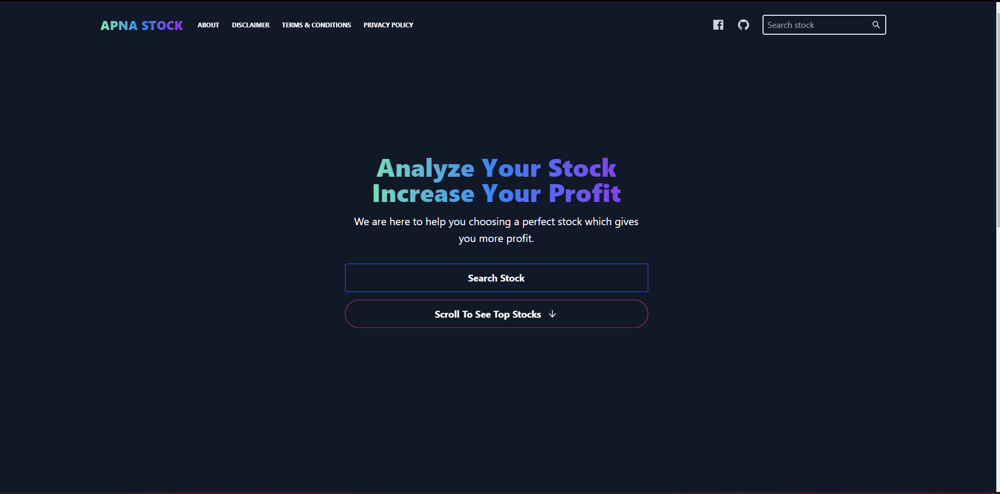
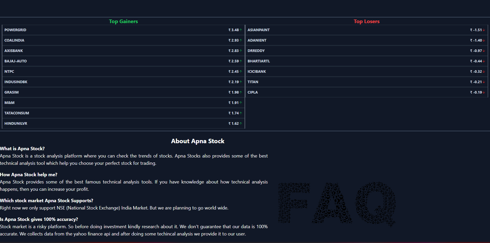
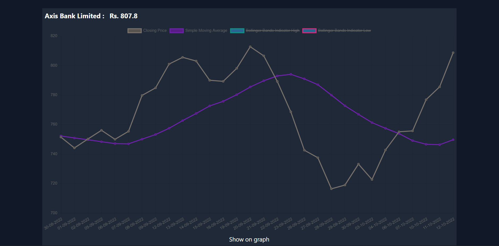
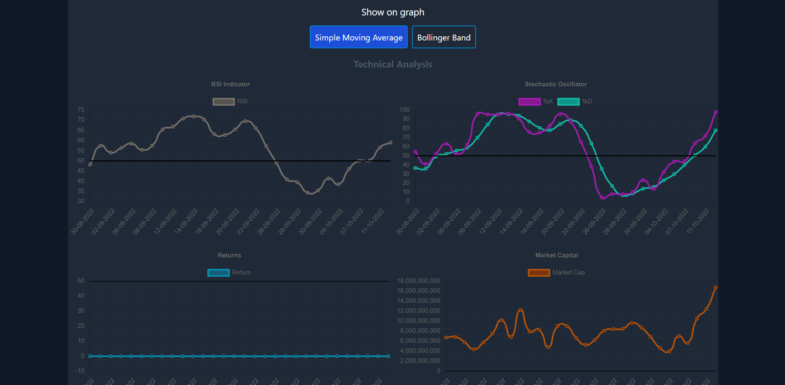
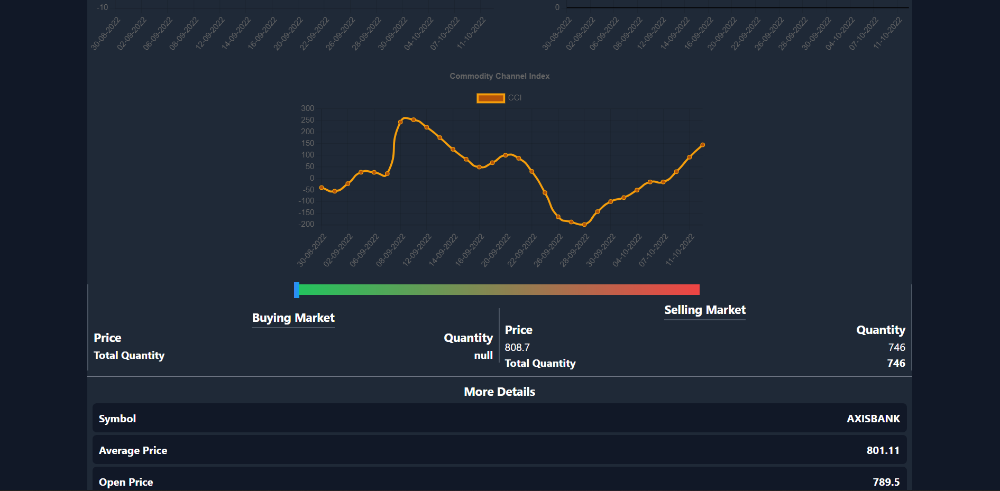

# Stock Analysis Using Machine Learning (Django + React JS)

You can use our tool for the analysis the stock and also you can predict the price of stock.
We use some of the best indicators for the analysis of the stock, Eg: Simple Moving Average, Bollinger Bands, Stochastic Oscillator, Commodity Channel Index And RSI.
By analyzing these indicators you can predict the movement of the stock.
# Steps For Deployment
- You should have Python 3 and Node Js installed in your computer.
- Download/Clone the Repository.
- Go to the main directory.
- Open Terminal and install Python libraries using
  `pip install -r requirements.txt`
- After that `python manage.py runserver`
- After running the above command the server will be running on 8000 port. It will be accessible on http://localhost:8000
- After that go to frontend directory and in your terminal run `npm install`
- This will install all the necessary libraries for running the react app.
- Then run `npm start`
- Now you can access the website on port 3000. http://localhost:3000
- You can builds the app for production to the build folder by running `npm run build`
- After running npm run build you don't have to on the node server. Your website will be accessible on Django server on 8000 port.
- You can use this app by opening http://localhost:8000
## Screen Shots

### Homepage

### Top gainer and losers list

### Price graph of the stock

### Indicators

### Indicators and details

## Note
Nobody ever made high returns in the stock market without taking risk. In fact, the more the risk you take, the more you might earn. But then again, it is 'risk'. The more risk you take, the more you might lose too. So kindly invest at your own risk.

#### Is this tool gives 100% accuracy?
Stock market is a risky platform. So before doing investment kindly research about it. We don't guarantee that our data is 100% accurate. We collects data from the yahoo finance api and after doing some techincal analysis we provide it to our user.
